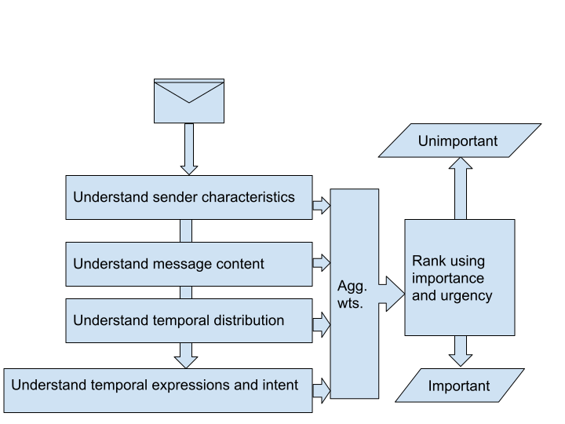

**Table Of Contents**

CHAPTER 1: INTRODUCTION
=======================

1.1 Statement of the Problem
----------------------------

Email is the most popular mode of communication. Due to its broad
adoption, people are sending and receiving an ever increasing amount of
messages. On average, an office worker receives 121 messages each
day[1]. Due to this sheer volume, users are left with burden to sort
through large number of messages of varying importance and urgency. To
sort through all of these emails might cause important emails to get
buried which in turn affect relationships between the sender and
recipients or their work. This also causes significant effect on
personal and work performance. Similarly, lots of incoming email
messages results in feeling of overload and stress due to constant
interruption from email.

Indeed, most of the emails are either spam, irrelevant, advertisements
or informations. Only about 15% of the emails require any action[2].

Within each category, emails have different priority with some requiring
immediate response whereas some can be dealt later. To deal with these
problems, application designers have been developing efficient search
engines, and task management tools around emails. In addition,
researchers have developed tools to combat spams.

To solve this email/information overload, we have our set of goals which
has been discussed in section 1.2 of this chapter.

1.2 Objectives
--------------

We have following objectives for this project to manage email overload
and reduce one’s stress:

1. To identify features of email messages that users are likely to find
   important or urgent.

2. To facilitate dealing with the large number of emails in a short
   amount of time using prioritization that is personalized.

1.3 Applications
----------------

The project can be applicable inside any of the email client
applications as a feature, or as a separate application that can rank
the incoming messages based on the priority based on different
features/signals of the message. This can be also used to get insights
into emails, user behaviors regarding those emails, *et cetera*.

1.4 Project Features
--------------------

The feature of the project is to surface emails to the user based on
it’s priority. This categorization(into **important** and
**unimportant**) can be done using heuristics and different NLP
techniques to find signals to determine urgency and/or importance of the
message(s). This project should have lower false positive than false
negative, as users also read the mail that are not important [3].

We will also be developing an email client, though, we will be mainly
focused in the prioritization of the emails.

The methods will be discussed in more details in the chapter 3.

1.5 Feasibility Study
---------------------

For this project, feasibility study was done on the technical,
economical and operational areas to understand the viability and
practicality of the project. The results of the study are briefly
presented below:

1.5.1 Technical Feasibility
---------------------------

We selected this project as we wanted to work on specific sets of
problems. But, after study of technical areas, things didn’t turn out so
simple.

Prioritizing email using personalized features was/is not
straightforward due to the individual differences in email handling. The
dataset will be limited to train for personalization and, thus the
algorithm should be effective only on limited data. Also, due to the
possibility of privacy issues, we need to create different model for
different users to prevent data leaking between the users as done by [4]
or, create a global model that shares the characteristics from all the
users and have different sets of user models for personalized
characteristics [3].

Horvitz et al. [5] developed a system aimed at inferring criticality of
messages and prioritizing email received.

Also, for the study, we needed to better understand what constitutes a
priority. The study [3] found out that the users rated messages as
important if they were about work and required action. If the emails are
requests for action, information, status updates and reminders, then the
user identify them as important. The strong influence of requests for
action and scheduling on the message’s perceived importance indicates
impacts of other’s demands on how people direct their attention on job.

1.5.2 Economic Feasibility
--------------------------

As per the above technical study, we need to prepare and clean our data
and train our models to categorize messages into important and
unimportant and rank them based on priority. We need to build the whole
pipeline in cloud for deploying purposes as our local machine will not
be able to handle this or would take longer. For exploratory purposes,
and/or building smaller models, we can work incrementally and share the
models with each other.

To create a complete project, we need database servers, task servers,
GPU machines and development tools such as text editors, coverage tools,
build tools, CI tools, etc. However, we will be able to use this through
discounts provided by various vendors for students.

1.6 System Requirements
-----------------------

After the feasibility study, the system requirements was deduced. The
requirements are broadly categorized into two:

1.6.1 Software Requirements
---------------------------

The most of our requirements is in software, as we are focused on
creating a better algorithm for ranking and prioritizing the messages in
email. We have following user requirements for the software:

1. User should be able to view important mails straight away

2. User should be able to view other emails easily.

3. User should be in ease with the user interface.

4. User should be able to use other existing features of email.

To accomplish above user requirements, the system should be capable of
fulfilling following requirements:

1. Should be able to work on limited amount of data.

2. Should be able to predict probability that user will interact with
   mail.

3. Should work even on noisy data.

4. Should be able to learn online.

5. Should be able to work without any explicit user labelling.

6. Should have low false positive than false negative.

1.6.2 Hardware Requirements
---------------------------

We need hardware to train our models/algorithms. But, this can be easily
done using our local machine. However, training will be faster on a
high-end machines having good GPU.

CHAPTER 2: LITERATURE REVIEW
============================

**2.1 Prior Email Prioritization**

One of the early efforts in email prioritization by Horvitz et al. [5]
used Support Vector Machines in an email alerting system to classify new
email messages into two categories, i.e., high or low in terms of
utility. It provided probabilistic scores along with system-made
predictions. However, they didn’t consider user personalization,
priority modeling and social network analysis in their approach.

Hasegawa and Ohara [6] proposed to use a Linear Regression to evaluate
the email messages into two levels. About one thousand rules were used
to extract features and they evaluated their model on only one user
albeit they mentioned that the priority should be personalized. It
didn’t evaluate different priority modeling approaches and social
network analysis.

**2.2 Machine Learning Methods for Personalized Email Prioritization**

Yoo, Shinjae [4] modeled the priority of the email messages in terms of
intrinsic importances known as Eisenhower priority matrix and also the
importance and the urgency of an email. The importance stands for how
important the email is to the recipient and urgency stands for how
urgent the email is to the recipient with respect to the recipient’s
reaction. In this approach, Yoo has modeled the priority with five
levels in terms of importance. To make prioritization system realistic,
at least three levels or more are required: low, medium and high. During
user study, it was observed that the most dominant priority is medium.
Yoo proposed a fully personalized methodology for technical development
and evaluation where only the personal email data (textual or social
network information) of each user is available for the system during the
training and testing of the user-specific model. It proposed to use
multiple models with the considerations of adjacent priority relations.
There were some challenges which made the research difficult like no
publicly available datasets, lack of previous researches and sparse
training data.

**2.3 Making a Manageable Email Experience with Deep Learning**

Louis Eugene and Isaac Caswell [7] used Deep learning algorithms and
applied them to the task of prioritizing emails based on their
importance and whether they require an answer. They used bag of unigrams
and bigrams model with SVM and Random Forests as a baseline and then
develop an LSTM network and a Convolutional Neural Network as a way to
improve the results. The CNN method yielded the highest accuracy and F1
for most of the datasets. Eugene used the Parakweet Intent dataset and
Isaac’s Stanford Email Datasets where the emails were already labeled if
it required an action or if it was important.

**2.4 The Learning Behind Gmail Priority Inbox**

Douglas Aberdeen, Ondrej Pacovsky and Andrew Slater [3] in their paper
titled "The Learning Behind Gmail Priority Inbox" discuss about the
working of the Gmail Priority Inbox. The priority Inbox feature of Gmail
ranks mail by the probability that the user will perform an action on
that mail. Because “importance” is highly personal, they try to predict
it by learning a per-user statistical model, updated as frequently as
possible. It used hundred of features such as Social features, Content
features, Thread features, Label features and so on. They used a simple
linear logistic regression model to keep learning and prediction
scalable and determine a per user threshold for s to classify each mail
as important or not important. The accuracy of the model was found to be
around 80±5 per cent on a control group.

**2.5 Understanding Email Use: Predicting Action on a Message**

The paper[2] examined people's ratings of message importance and the
actions they took on specific email messages, based on message
characteristics and characteristics of receivers and senders. The
findings was that the user rated messages important if they were about
work. But, the **importance** differed from user to user for
other reasons than the message (i.e. social nature). It depended not
just the **message importance** but also on sender characteristics,
complexity of the job, content of the message, email habits of the user.
According to [2], request for actions, information requests, status
updates, reminders and schedules were deemed important by the user
whereas social messages were deemed less important.

**2.6 Learning to Classify Email into "Speech Acts"**

The paper[8] discusses using machine learning to classify email
according to the intent of the sender, particularly using ontology of
verbs which jointly describe "email speech act" intended by the email
sender. They demonstrated that the certain messages can be detected with
high precision and reasonable recall using existing text-classification
learning methods.

--------------

CHAPTER 3: METHODOLOGY
======================

3.1 Tools
---------

The following tools will help us in development and providing insights
to us:

.. raw:: html

   <table>
     <tr>
       <td>

Categories

.. raw:: html

   </td>
       <td>

Tools

.. raw:: html

   </td>
     </tr>
     <tr>
       <td>

Programming languages

.. raw:: html

   </td>
       <td>

Python, Node, JS

.. raw:: html

   </td>
     </tr>
     <tr>
       <td>

Visualization Tools

.. raw:: html

   </td>
       <td>

Matplotlib, Bokeh, Seaborn

.. raw:: html

   </td>
     </tr>
     <tr>
       <td>

Deep learning

.. raw:: html

   </td>
       <td>

Tensorflow, Keras, Pytorch

.. raw:: html

   </td>
     </tr>
     <tr>
       <td>

Statistical tools

.. raw:: html

   </td>
       <td>

Scipy, Statsmodels

.. raw:: html

   </td>
     </tr>
     <tr>
       <td>

Data manipulation tools

.. raw:: html

   </td>
       <td>

Pandas, Postgresql

.. raw:: html

   </td>
     </tr>
     <tr>
       <td>

NLP

.. raw:: html

   </td>
       <td>

NLTK, spacy, textacy, Patterns, textglob, gensimzz

.. raw:: html

   </td>
     </tr>
     <tr>
       <td>

Network modeling

.. raw:: html

   </td>
       <td>

NetworkX

.. raw:: html

   </td>
     </tr>
     <tr>
       <td>

Documentation tools

.. raw:: html

   </td>
       <td>

Sphinx, Latex

.. raw:: html

   </td>
     </tr>
     <tr>
       <td>

Client/Server

.. raw:: html

   </td>
       <td>

Electron(Client), Flask(API server)

.. raw:: html

   </td>
     </tr>
   </table>

3.2 Description of the proposed system
--------------------------------------

The proposed system will be in the form of a email client. The system
which will be personalized for each user will be able to classify all
the incoming emails of the user based on priority. The system will also
be able to sort the emails of the user based on the priority so that the
user will be able to respond to the emails which require urgent
response. The emails will be classified in the basis of importance and
urgency or the need to reply on the email.

Email prioritization is a dynamic task unlike spam filtering where we
have a pool of static data from where we can classify each email as spam
or not. But email priority is relative and may differ for each user
based on various factors. This will require us to be able to personalize
the system for each user so that the emails for each user can be
correctly classified.

|Figure 3.2: Flowchart of Ranking Process| Figure 3.2: Flowchart of
Ranking Process

The traditional methods used in email prioritization often use basic
email features such as sender, receiver, time, subject, files and
attachments to rank the emails based on priority.

Our system will use some additional features such as intention and
temporal expression in addition to aforementioned features. This will
require us to use various natural language processing methods in order
to extract those features from the email body.

Temporal expressions(i.e. the time/date expressions such as "2pm",
“Friday”) determines the urgency of the emails. The intentions from the
email determines if it requires any response. As per [2], this kind of
emails are deemed important by the user. We can also use social
features(i.e **in-degree** and **out-degree**) to calculate sender
characteristics and threads’ time distribution over a limited amount of
time(hours/days/weeks) to determine threaded characteristics. We could
combine these signals and create a ranking algorithm to classify mails
into **important** and **unimportant**.

At first, we will prepare the data necessary for the project. We have to
clean unnecessary data and also handle missing data. We will perform
exploratory analysis on the data to get an insight. Then, as per our
analysis, we will work on different algorithms and techniques to create
a ranking algorithm that can work better on noisy and scarce data. Then,
we will iteratively work on adding personalized features for users. We
will validate our algorithm using selected evaluation metrics (see
section 3.4 for more details).

After the completion of validation and if we are satisfied with the
results, we will create a desktop client and an API server and provide
integrations into top email service provider.

3.3 Software Development Lifecycle
----------------------------------

Our proposed system will be built using Scrum/Agile, which is an
iterative method of development. The agile way of software development
usually emphasize teamwork, frequent deliveries of working software and
close collaboration. The main advantage of using the agile software
development is ability to adapt quickly to the changes that may occur
further down the road. We will work incrementally on the project with
each increment adding a small feature. Using this model of software
development creates better communication amlong the team members and
thus making us more productive and efficient as a team.

3.4 Evaluation metrics
----------------------

As the algorithm should be able to work on limited amount of data and
should have lower false negative than false positive, classification
accuracy is not enough and requires balance between precision and
recall, and therefore "F1 score" will be a better measure. Also, it
would be better to have a baseline for evaluation.

To create a baseline for us to improve, we can use either traditional
approach(heuristics) or google’s **important** labeled messages with our
approach. But, the latter might be biased due to the algorithm used to
label the messages. But, it would be an interesting baseline for us to
work with.

3.5 Available Datasets
----------------------

The datasets related to emails are not many, mostly due to privacy
concerns. Anonymized data will work to create personalized features.
Mainly, we will use two main datasets, and others that are derived from
these two. But, to use our ranking algorithm, we have to work with both
as both are required to accomplish our task(as they both have different
characteristics).

1. Enron E-mail Dataset

This dataset was collected and prepared by the CALO Project (A Cognitive
Assistant that Learns and Organizes). It contains data from about 150
users, mostly senior management of Enron, organized into folders. The
corpus contains a total of about 0.5M messages. Parakweet Labs annotated
this dataset which will be helpful on finding out intention/action of
the emails.

2. The BC3: British Columbia Conversation Corpora

The corpus consists of 40 email threads (3222 sentences) from
the W3C
corpus.. Each thread has been annotated by three different annotators.
The annotation consists of the Extractive Summaries and Abstractive
Summaries with linked sentences. Sentences are labeled with "Speech
Acts: Propose, Request, Commit, Meeting", Meta Sentences and
Subjectivity.

This dataset can be used to get insights on thread characteristics such
as temporal distributions, etc.

CHAPTER 4: EPILOGUE
===================

4.1 Deliverables
----------------

By the end of the project, we will be delivering a desktop email client
which can display emails based on priority. The desktop app will
interact with our api backend web server to retrieve the mail
data(prioritized and others). Through this system, user will be able to
identify features of email messages that they are likely to find
important or urgent.

4.2 Budget Expenses
-------------------

According to our estimation the budget expenses required for completion
of the project is allocated in the table below:

.. raw:: html

   <table>
     <tr>
       <td>

Field of Allocation

.. raw:: html

   </td>
       <td>

Estimated cost

.. raw:: html

   </td>
     </tr>
     <tr>
       <td>

Documentation

.. raw:: html

   </td>
       <td>     

Rs. 1000

.. raw:: html

   </td>
     </tr>
     <tr>
       <td>

Miscellaneous

.. raw:: html

   </td>
       <td>     

Rs. 1000

.. raw:: html

   </td>
     </tr>
     <tr>
       <td>

Total

.. raw:: html

   </td>
       <td>     

Rs. 2000

.. raw:: html

   </td>
     </tr>
   </table>

4.3 Work Schedule
-----------------

The project is scheduled to complete in different phases as shown in the
table below:

.. raw:: html

   <table>
     <tr>
       <td>

Task

.. raw:: html

   </td>
       <td>

Target Date

.. raw:: html

   </td>
     </tr>
     <tr>
       <td>

Research

.. raw:: html

   </td>
       <td>

28 Jan, 2019

.. raw:: html

   </td>
     </tr>
     <tr>
       <td>

Process data using different methods

.. raw:: html

   </td>
       <td>

28 Feb, 2019

.. raw:: html

   </td>
     </tr>
     <tr>
       <td>

Feature engineering

.. raw:: html

   </td>
       <td>

02 March, 2019

.. raw:: html

   </td>
     </tr>
     <tr>
       <td>

Modelling

.. raw:: html

   </td>
       <td>

15 June, 2019

.. raw:: html

   </td>
     </tr>
     <tr>
       <td>

Validating

.. raw:: html

   </td>
       <td>

30 June, 2019

.. raw:: html

   </td>
     </tr>
     <tr>
       <td>

Developing Client

.. raw:: html

   </td>
       <td>

29 July, 2019

.. raw:: html

   </td>
     </tr>
     <tr>
       <td></td>
       <td></td>
     </tr>
   </table>

REFERENCES
==========

[1] 32 Insane Facts About Email 2018 - Mailbird", *Mailbird*, 2018.
[Online]. Available: https://www.getmailbird.com/email-facts/

[2] L. A. Dabbis, R. E. Kraut, S. Fussel, and S. Kiesler, "Understanding
Email Use: Predicting Action on a Message ," *CHI '05 Proceedings of the
SIGCHI Conference on Human Factors in Computing Systems*, pp. 691–700,
2005.

[3] D. Aberdeen, O. Pacovsky & A. Slater, "The Learning Behind Gmail
Priority Inbox".

[4] Yoo S. et al., "Machine Learning Methods for Personalized Email
Prioritization Ph." (2009).

[5] E. Horvitz, A. Jacobs, & D. Hovel. "Attention-sensitive alerting".
In Kathryn B. Laskey and Henri Prade, editors, *UAI ’99: Proceedings of
the Fifteenth Conference on Uncertainty in Artificial Intelligence,
Stockholm, Sweden, July 30-August 1, 1999*, pages 305–313. Morgan
Kaufmann, 1999.

[6] T. Hasegawa and H. Ohara. "Automatic priority assignment to E-mail
messages based on information extraction and user’s action history". In
Rasiah Loganantharaj and Gunther Palm, editors, *Intelligent Problem
Solving, Methodologies and Approaches, 13th International Conference on
Industrial and Engineering Applications of Artificial Intelligence and
Expert Systems*, *IEA/AIE 2000, New Orleans, Louisiana, USA, June 19-22,
2000, Proceedings*, volume 1821 of Lecture Notes in Computer Science,
pages 573–582. Springer, 2000.

[7] L. Eugene & I. Caswell. "Making a Manageable Email Experience with
Deep Learning".

[8] W.W. Cohen, V.R. Carvalho & T.M. Mitchell, "Learning to Classify
Email into “Speech Acts".

